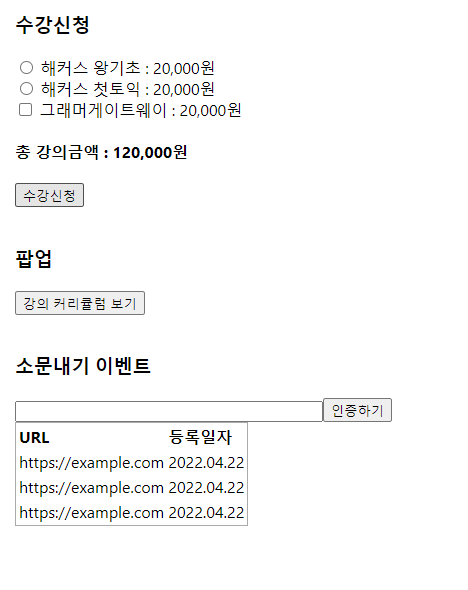

# 🍔 리액트 스터디 3주차 실습 예제 🍔

### 실사이트 이벤트 페이지에 적용해보기

 

현재까지 배운 리액트 문법 (useState, useEffect, props)를 이용하여  
해커스 이벤트 페이지 기능을 간단하게 구현할 수 있습니다 ! 

 

*참고 사이트 - https://champ.hackers.com/?c=event&evt_id=19072200 (0원 패스 페이지)  

### 구현해야 하는 기능

1. 수강신청
2. 팝업
3. 소문내기 이벤트 

 

## 각 기능 설명

### 수강신청
> 교재를 선택한 후, 수강신청 버튼 클릭시 '수강신청이 완료되었습니다!' alert 창을 출력해주시면 됩니다.
> - 강의 가격은 130,000원, 교재는 권당 20,000원 입니다.
> - 교재는 총 3권입니다.
>   1. 해커스 왕기초
>   2. 해커스 첫토익
>   3. 그래머게이트웨이
> 
> 💣 조건사항
> 1. 교재 1, 2번은 라디오버튼이며, 무조건 왕기초 or 첫토익 중 하나를 골라야 수강신청 버튼 클릭 가능
> 2. 그래머게이트웨이는 단권 선택 불가능, 위 두 교재 중 한권을 선택하지 않았다면  
'토익교재 포함 선택 시 그래머 게이트웨이 교재를 선택할 수 있습니다.' 텍스트를 하단에 출력 (alert창 아닙니다.)
> 3. 교재 선택시 총 강의금액에 교재 가격 더하기 필요

 

### 팝업
> 교재 커리큘럼 버튼 클릭시, 아래 이미지가 포함된 팝업을 on/off 되도록 작업해주시면 됩니다.  
> [팝업이미지] '//gscdn.hackers.co.kr/champ/img/event/2019/07/2200/pc/type3/v1/curri_pop_500_01.jpg'

 

### 소문내기 이벤트
> 첫 실행시 예제 폴더 내에 있는 'event-list.json'에 있는 데이터를 받아와 리스트 출력,  
> 폼에서 url입력시 데이터가 추가되는 기능을 구현해주시면 됩니다.  
> 
> 💣 조건사항
> 1. 입력창에 값이 없는데 버튼 클릭시 'url을 입력해주세요' 텍스트를 하단에 출력 
> 2. 데이터 추가시 등록된 날짜도 함께 저장필요. (Date)

